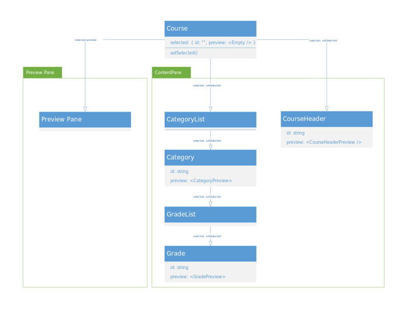
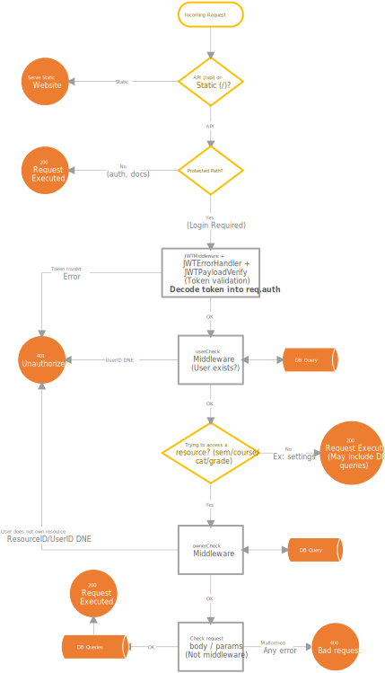

# Architecture

# Stakeholders

We designate two classes of users that are involved with the application: users of GradeTrackLite and the host.

## Users

Users are those who use an instance GradeTrackLite by creating an account on that instance. They are the ones who can login and manage their grades. They only interact with the frontend webapp.

They would usually be students.

## Host

Hosts are those who are hosting an instance of GradeTrackLite on their machine. They are the data controllers for any users of their instance, and only interact with the backend. Note that they do not have an "account" stored on any database, rather they simply have full control to the application's backend and can modify it by providing privacy policies and terms, enabling HTTPS, etc.

They could be the students themselves, parents, schools, etc.

# Architectural Design Decisions

GradeTrackLite's architectural design is based on a client-server model, with a front-end and back-end designed to interact and communicate with each other to allow an efficient and seamless user experience. The major technology used for version control is GitLab, which allows for efficient code handling and tracking.

## Frontend

### Technologies

Although making a website with nothing but raw HTML, CSS and JavaScript is definitely possible, we find that using a framework library makes development easier and results in more maintainable code. With the right choice, we do not believe this poses a privacy risk.

We ultimately chose to use **React**. React is an open-source JavaScript library used for building user interfaces that comes with a lot of benefits. In brief, React provides Components that can be taught of as an HTML **div and its content**. These components have states which are used in rendering the component, similar to variables. Changing any of these states will prompt React to re-render the component (hence the name, React). Considering that we are dealing with lots of data in JSON form that must be displayed on the screen, we find that this paradigm fits well.

For deployment, we can compile the React app into HTML, CSS, and JavaScript files, which can be served by any webserver.

While React is spearheaded by Meta, a company known for questionable data collection practices, we do not believe that React inherently poses more privacy risk than any other library or framework (or lack thereof). We believe this because React is open-source and is extremely widely used, so it is open to be inspected by third-party security experts. Any privacy violations would likely already be found by the community and caused backlash. The fact that we could not find any evidence of React collecting data on behalf of Meta nor noticed any unexpected network requests once deployed cements this.

Instead, we believe most of the privacy risks associated with the frontend is with the use of **third-party libraries and scripts** alongside React. Should the library be closed-source or unpopular, there is a higher chance of vulnerabilities (or even outright data collection) being present with no one to find them. As such, we tried to use a smaller amount of libraries, and to use larger ones when possible.

We believe the largest privacy risk in the frontend is the setup script **create-react-app**. While open-source, supported by Meta, and the recommended way to create a React app for years, it has been getting less frequent updates as of late. In fact, as we were doing the project, it seems to have been delisted as the recommended way to create a React app on the React website [^cra-abandon][^cra-react-page]. Installing it with the node package manager even reveals a number of vulnerabilities in its dependencies (6). This number has fluctuated with time, but it will likely begin increasing now that development has slowed. For this reason, we are looking into switching the development environment to Vite, although since the project has already been created, we do not know if this will be finished before the deadline, depending on the ease of migration.

[^cra-abandon]: A. Gautam, "Goodbye create-react-app", dev.to, https://dev.to/ag2byte/create-react-app-is-officially-dead-h7o

[^cra-react-page]: "Start a New React Project", react.dev, https://react.dev/learn/start-a-new-react-project

Finally, we initially considered using Typescript instead of JavaScript to reduce the possibility of runtime errors that occur frequently in untyped languages. However, the documentation for using it with React was not nearly as extensive compared to JS in addition to having a much larger initial setup complexity. As we were not familiar with React, we started with JS. Now, converting to TS would be hard, so we used `// @ts-check` and declared types in JSDocs whenever possible so that the IDEs and linters would spot type errors in the static code.

### Cookies and Storage

The frontend only stores data using cookies. It does not touch Local Storage, Session Storage, WebSQL, IndexedDB or any other browser storage locations.

Only two cookies are ever stored.

- token
  - Stores the user's login token. It can be decoded, and its content revealed which may constitute PII (username). Removed on logout.
- theme
  - Stores the user's theme preference ("light" or "dark"). It is only set if the user clicks the theme button, otherwise the site's theme follows their OS preferences.

We chose to store the few data we do store in cookies instead of local storage, despite it being more programmer friendly because privacy enhancing settings and extensions tend to target cookies, and we wish to respect the user's privacy settings as much as possible.

## Backend

### Technologies

There is considerable debate on what to use for the back-end REST API, with Spring (Java), ASP.NET (C#), Django (Python), and Express (JavaScript) being considered. Once again, all of these are open source and very popular, and we believe it is not possible to confidently say if any one of them is more inherently secure or private than the other. Ultimately, we decided to use Express.js as there are a lot of guides and resources for the MERN (MongoDB, Express, React, Node) stack, and since the front-end also uses JavaScript. We do not use the "M" (i.e., MongoDB), but the resources on MERN are still helpful.

Another consideration is that we want to easily host the compiled static React page on the same framework instead of requiring the host to have a dedicated webserver such as Apache or Nginx on their machines. The chosen framework must be able to serve static pages.

Express.js is a framework to build REST APIs running on Node.js. Node.js is a JavaScript runtime environment built on Google Chrome's V8 engine, which allows for efficient and high-performance server-side programming. One advantage of using Node.js and Express.js is that they have large and active communities that are dedicated to improving the security and privacy features of the platforms. This helps ensure that security vulnerabilities are quickly identified and addressed. Furthermore, it is possible to use HTTPS, which provides secure data transmission between the client and server, protecting user data from interception by malicious third parties. In addition, Express.js' middleware-based architecture allows developers to easily implement security and privacy measures, such as authentication (which can be done with JWT tokens). Finally, serving static pages with Express is very easy.

### Authentication

We use [JSON Web Tokens]([https://jwt.io/introduction](https://jwt.io/introduction)), (JWT) to manage user sessions. JWTs are tokens that are signed by the issuer, such that they cannot be modified or forged. If they are, the verification process will detect the mismatch between the content and signature and reject the token. Finally, we can embed information into the JWT such as expiration time, username, etc. This allows us to avoid dealing with storing session tokens in the database.

JWTs also provide several benefits. JWTs are a secure way to authenticate and authorize users, preventing third parties from accessing a user's data. In addition, the portability of these tokens makes it easier to use them for different parts of our application, rather than having the user constantly logging in. Furthermore, JWTs can be signed with a secret key, ensuring their integrity and authenticity. It is even possible to set an expiration time to minimize exposure to malicious third parties. To top it all off, all these layers of security can be validated quickly and efficiently (as they are self-contained), making the application more secure while still providing a smooth user experience.

Finally, there are reputable open-source Express middleware implementations of JWT.

### Storage

Since we want the app to be self-hostable by a person without advanced computer or programming knowledge, we do not believe it is reasonable to use any software-as-a-service database requiring an account such as MongoDB. Furthermore, we do not want to let hosts deal with multiple separate intercommunicating processes such as Express plus a standalone database application.

As such, we decided to use [SQLite]([https://sqlite.org/index.html](https://sqlite.org/index.html)) as it is not a database application in the conventional sense. Rather, it is a library that is used by whatever process wants access to the database (such as the Express process). The entire database is stored in a single file and all concurrency controls are managed via file locking rather than one dedicated database process. This means the host only has to worry about one process.

SQLite has a number of advantages over using a software-as-a-service database. We believe that it provides better privacy as all the data is stored on the host's own machine rather than held by a company such as MongoDB. MongoDB Atlas is free to use, yet we have learned in this course to be wary of the intentions of "free" services. In addition, variants of SQLite exist that allow encrypting the database.

However, being merely a simple file, it is likely that SQLite's access controls aren't as robust as MongoDB (or some other service's) in the event that the host's machine does get compromised. We believe it is an acceptable tradeoff.

# Client-Server Communication

The communication process between the client and the server is handled through HTTP requests (or HTTPS), with the front-end sending requests to the back-end for data retrieval and the back-end sending responses containing the requested data. The app supports using HTTPS with SSL encryption, but it is an option that must be enabled with extra steps.

While it would be better from a privacy-by-default perspective to default to using HTTPS, using **HTTPS is not a simple toggleable option**. Instead, the host must provide their own SSL keys for the feature to work at all. As such, we provide a middle ground solution, where the build script will print out information on how to generate and self-sign a key. In addition, each time the app is started, it will warn the host if HTTPS is not enabled.

# Architectural Models

## Frontend State Management

Just like HTML, React components follow a "tree shape". This means that a parent component can pass its states to its children easily (the inverse is possible but requires much more work with callbacks). Whenever a parent's state change, it will re-render, and will also prompt its children to re-render if it passed that state to the child (recall, react re-renders component if they changed).

### Selection Management

A pattern common in the application is where an item is selected, and we display that selected item's information for editing. For example, we may select a grade and the content-pane will display that grade's information. If we then select a category, the content-pane will change to display that category's information. This is where we use the fact that all items have a unique ID to our advantage.

This is managed by having a state at the root component called "selected" that contains the ID of the currently selected item, and a component to display that item in the preview pane. It then passes that state and its setter to its children via a context (basically a "global variable"). On click, each selectable component can update the selected state to its own ID and its own custom preview component.

This allows the preview pane to be type-independent. Each selectable item provides their own preview component to display in the preview-pane.

In the figure below, the course holds a state "selected", which it passes to the preview pane for display (selected.preview). Then, it displays all categories, grades and its own information in the content pane. All elements in the content pane are selectable, and on click, they will set the selected value to their own ID, and a custom previewer for whatever type of item is selected (grade, category, course header, etc.).

Note that this is not an UML diagram as we are not using object-oriented programming. Rather, it represents a component tree with Course as its root. It is also a simplified representation of the model; this exact structure does not exist in the code.

A similar model is used to control the selected sidebar element and what is displayed right of it.

### Course Model

There is a balance between reducing data transfer (better privacy, security in the event of a malicious actor being present) and allowing the user to see more at any one time.

For example, we could load a user's entire data (owned semesters, courses, categories, grades) for simplicity in one big network request. However, it involves sending lots of private data that the user may not even use or look at, massively increasing the amount of data that could be intercepted should something go wrong.

On the other hand, if we only send one grade item at one time, and send more if the user selects another grade, the user won't get a "bigger picture view" of their grades even if it is technically safer. This would make for horrible usability.

We compromised and let the user select a semester and course, before sending the entirety of the data concerning that course (categories, grades). Selecting another course or semester discards the currently stored course and loads a new one.

#### Synchronization

When the frontend obtains a course's data, it creates a model of that course in its states that is used for rendering the course's content.

Courses are tree-shaped: the course has grade categories, that each has grades. As such, we can build a component tree for the course-model. A course stores a list of categories in its states, a category stores a list of grades in its states.

We keep the course-model in sync with the server's version by updating the course-model instead of polling the course's content after each add, modify or delete request, and increasing the amount of data transferred. For example, if a user deletes a category and the request is successful, the frontend will remove that category from the course-model's category list. This in turn will trigger the re-rendering of the course.

## Backend Request Handling

### Routes

We designed the paths for requests ("the route") such that they are grouped by functionality. They generally follow the form: `hostname/api/v1/resourceOrFunctionality/action`. For example: `localhost:8000/api/v1/courses/list`

Each route category (e.g., localhost/api/v1/courses/…) is handled using **Express Router**.

| URL Element               | Description                                                                                                                                                                                                                                                                                                                                                                                                                                                                                                                                                                                                                             |
| ------------------------- | --------------------------------------------------------------------------------------------------------------------------------------------------------------------------------------------------------------------------------------------------------------------------------------------------------------------------------------------------------------------------------------------------------------------------------------------------------------------------------------------------------------------------------------------------------------------------------------------------------------------------------------- |
| `hostname`                | Always there. Address of the GradeTrackLite host                                                                                                                                                                                                                                                                                                                                                                                                                                                                                                                                                                                        |
| `api/v1`                  | Always there. To distinguish API versions and from static files served from `/`                                                                                                                                                                                                                                                                                                                                                                                                                                                                                                                                                         |
| `resourceOrFunctionality` | Denotes either a resource (`semesters`/`courses`/`categories`/`grades`) or a functionality such as authentication or account management (`auth`/`account`)                                                                                                                                                                                                                                                                                                                                                                                                                                                                          |
| `action`                  | Do some action with regards to the resource or functionality.  For data, we generally have:   <ul><li>`list`: Given a parent's ID, get a list of all instances of that resource belonging to the parent.</li><li>`add`: Given a parent's ID, add an instance of the resource to the parent</li><li>`get`: Get a specific instance of the resource (and all "children"). Currently only for courses (and that won't change).</li><li>`edit`: Modifies a specified instance of the resource.</li><li>`delete`: Deletes a specified instance of the resource</li></ul>For functionalities, we have stuff like `login`/`resister`/... |

### Middlewares (grey boxes)

We make extensive use of Express middlewares. In summary, each incoming request to an Express server passes through a chain of middlewares. Each middlewares can modify the request (such as adding a field) or stop the chain and send a response in which case the request won't reach the middlewares further along the chain. The last middleware in the chain (orange circles) actually executes the desired operation, but the request will only get there if it successfully goes through the other middlewares in the chain.

**Authentication Middleware**

- Technically 4 middlewares that are grouped together. This middleware checks if the request contains a valid JSON Web Token and decodes its payload (user id, username) into the request's field: **req.auth**. Finally, the middleware checks that the user actually exists by querying the database to protect against a situation where the token is still valid, but the user deleted their account.
  - If there is a failure at any point, the request is failed (HTTP code != 200).
  - This prevents non-logged in users from accessing any sensitive information.

**Ownership Middleware**

- Ran after the authentication middleware. This middleware checks whether the user owns the resource they are trying to access. For example, it checks whether a user owns a course before deleting it.
- This prevents users from accessing data that isn't theirs.

Using these middlewares to guard access to restricted routes permits a greater level of safety (through less code reuse, errors) than were we to check for all the security requirements manually at the last middleware.

### Requests

We distinguish between a few types of requests, with each passing through a set of middlewares for verification before the request is actually executed at the end of the chain (technically the last middleware).

#### Static Requests

Requests for static content such as the static compiled React webpage are served on route "/". They require no verification or middleware.

#### Unprotected Requests

Requests that don't require authentication such as accessing the privacy policy, logging in, and registering.

#### Protected Requests

Requests that don't target any resource and only require being logged in such as account management or adding a semester. These requests must pass through the **authentication middleware** before being executed.

#### Protected Resource Requests

Request that involves modifying a resource (semester, course, category, grade) such as adding a child item, modifying, or deleting. These requests must pass through both the **authentication middleware** and the **ownership middleware**.

# Important Scenarios

## User sign-up

A user must sign up to use the system. When they initially open the application, they will be prompted to sign in or to create an account. Should the user decide to create an account, they will be asked to create a username, a password, and asked for an optional email address. For security reasons, the text for the password box the user is typing in should be obfuscated, in case of any accidental screen recording, or on-lookers. If the information passed by the user is valid (I.e., the password and confirm password match, and the username is not taken), then the system will create a new username and password combination and store it in the database. The password will be salted and hashed when stored in the database. This should allow the user to use these credentials in the future to log in securely. 

## User login 

A user must log in to use the system. When they initially open the application, they will be prompted to sign in or to create an account. Should the user try to log in, they will be asked for a username, and a password. For security reasons, the text for the password box the user is typing in should be obfuscated, in case of any accidental screen recording, or on-lookers. When the user enters information into these boxes, the system will check that the username and password combination match an entry in the database. The password must be salted and hashed to check against the one stored in the database. 

## User delete account (example of non-resource protected API request)

If a user enters their setting menu, they can find a button that allows them to delete their account. On click of this button, a request is sent to `/api/v1/account/delete`. As with all protected API requests, the request will pass through the authentication middleware that will either validate or reject the user's token. If the token is valid, the request is sent to the `/account` Express Router where the request is executed (a SQL query) and a success response sent. If not, the request fails and the account is not deleted. The frontend will either display an error or immediately log out the user, depending on the situation.

## Add a grade to a category (example of resource protected API request)

If a user chooses to add a grade to a category in the frontend, the frontend will send an API request with the categoryID, and the new grade's information to `/api/v1/grades/add`. These types of requests first go through the authentication middleware. They are then sent to the `/grades` router, where they pass through an ownership middleware, where the ownership middleware will use a database query to determine if the user owns the category (a large join query). If this ownership middleware accepts, a new ID is generated and the grade is inserted. We then return the grade (with ID) to the user. The frontend will display an error or success depending on the case.

# References
